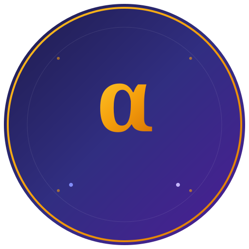

# QAAI - AI-Powered QA Automation Platform

<p align="center">
  
</p>

<p align="center">
  <strong>Enterprise-grade test automation with AI-powered test generation and self-healing</strong>
</p>

<p align="center">
  <a href="#features">Features</a> •
  <a href="#quick-start">Quick Start</a> •
  <a href="#documentation">Documentation</a> •
  <a href="#architecture">Architecture</a> •
  <a href="#contributing">Contributing</a>
</p>

---

## Features

| Feature | Description |
|---------|-------------|
| 🎬 **Visual Test Recording** | Browser extension captures interactions, generates Playwright scripts |
| 🤖 **AI Test Generation** | Generate tests from requirements using Claude or local Ollama |
| 🔧 **Self-Healing Tests** | Automatically fix broken selectors during execution |
| 📊 **Real-Time Dashboard** | Live execution progress with WebSocket updates |
| 🏢 **Multi-Framework Export** | Playwright (Python/TS), Selenium, Cypress support |
| 📱 **Enterprise App Support** | Smart selectors for Salesforce, ServiceNow, Workday, etc. |

---

## Quick Start

### Prerequisites

- **Node.js** 18+ and npm
- **Python** 3.10+
- **Chrome** browser (for Flowstral extension)

### 1. Clone the Repository

```bash
git clone https://github.com/maddynolan/QAOne.git
cd QAOne
```

### 2. Start the Backend

```bash
cd backend
pip install -r requirements.txt
python -m uvicorn app.main:app --host 0.0.0.0 --port 8000 --reload
```

The backend will be running at `http://localhost:8000`

### 3. Start the Frontend

```bash
# In the root directory
npm install
npm run dev
```

The frontend will be running at `http://localhost:5173`

### 4. Install the Browser Extension

1. Open Chrome and go to `chrome://extensions`
2. Enable "Developer mode" (top right)
3. Click "Load unpacked"
4. Select the `flowstral-extension` directory
5. Pin the extension to your toolbar

### 5. Configure AI (Optional)

#### For Anthropic Claude:
```bash
# In backend/.env
ANTHROPIC_API_KEY=sk-ant-your-key-here
```

#### For Local Ollama:
```bash
# Install Ollama from https://ollama.ai
ollama pull qwen2.5:7b

# In backend/.env
OLLAMA_URL=http://localhost:11434
```

---

## Usage

### Recording a Test

1. Navigate to any website
2. Click the Flowstral extension icon
3. Click **Start Recording**
4. Perform your test steps
5. Click **Stop Recording**
6. Click **Open in Workflow Editor**

### Running a Test

1. In the Workflow Editor, click **Run**
2. Watch real-time progress
3. View results and any self-healed selectors

### Saving Tests

1. Click **Save Test Case**
2. Enter a name
3. Test is saved and visible in Test Cases tab

---

## Project Structure

```
QAAI/
├── backend/                    # FastAPI Python backend
│   ├── app/
│   │   ├── main.py            # Application entry
│   │   ├── routers/           # API endpoints
│   │   ├── services/          # Business logic
│   │   └── utils/             # Helpers
│   └── logs/                  # Application logs
│
├── src/                       # React TypeScript frontend
│   ├── pages/                 # Route components
│   ├── components/            # Reusable UI components
│   ├── hooks/                 # Custom React hooks
│   └── lib/                   # Services and utilities
│
├── flowstral-extension/       # Chrome recording extension
│   └── src/
│       ├── content/           # Page injection script
│       ├── background/        # Service worker
│       └── sidepanel/         # Extension UI
│
├── supabase/                  # Database migrations
│   └── migrations/
│
└── docs/                      # Documentation
    ├── ARCHITECTURE.md
    ├── BACKEND_REFERENCE.md
    ├── FRONTEND_REFERENCE.md
    ├── FLOWSTRAL_EXTENSION.md
    └── DATABASE_SCHEMA.md
```

---

## Documentation

| Document | Description |
|----------|-------------|
| [Architecture](docs/ARCHITECTURE.md) | System overview, technology stack, data flow |
| [Backend Reference](docs/BACKEND_REFERENCE.md) | API routers, services, database operations |
| [Frontend Reference](docs/FRONTEND_REFERENCE.md) | Pages, components, hooks, state management |
| [Flowstral Extension](docs/FLOWSTRAL_EXTENSION.md) | Browser extension architecture and usage |
| [Database Schema](docs/DATABASE_SCHEMA.md) | Tables, types, migrations, RLS policies |

---

## Architecture

```
┌─────────────────────────────────────────────────────────────────────────────┐
│                              QAAI Platform                                   │
├─────────────────────────────────────────────────────────────────────────────┤
│                                                                              │
│  ┌──────────────────┐     ┌──────────────────┐     ┌──────────────────┐    │
│  │   React Frontend │────▶│  FastAPI Backend │────▶│   PostgreSQL/    │    │
│  │   (TypeScript)   │◀────│    (Python)      │◀────│   SQLite DB      │    │
│  └──────────────────┘     └──────────────────┘     └──────────────────┘    │
│          │                        │                                         │
│          │                        ├─────────────────────────────────────┐   │
│          ▼                        ▼                                     ▼   │
│  ┌──────────────────┐    ┌──────────────────┐             ┌─────────────┐  │
│  │ Flowstral Chrome │    │   LLM Services   │             │  Playwright │  │
│  │    Extension     │    │ (Claude/Ollama)  │             │   Runtime   │  │
│  └──────────────────┘    └──────────────────┘             └─────────────┘  │
│                                                                              │
└─────────────────────────────────────────────────────────────────────────────┘
```

---

## Key Technologies

### Backend
- **FastAPI** - High-performance Python web framework
- **Playwright** - Browser automation
- **PostgreSQL/SQLite** - Database
- **WebSocket** - Real-time communication

### Frontend
- **React 18** - UI framework
- **TypeScript** - Type safety
- **Vite** - Build tool
- **Tailwind CSS** - Styling
- **shadcn/ui** - Component library

### AI/ML
- **Anthropic Claude** - Cloud LLM
- **Ollama** - Local LLM
- **Prompt Caching** - Cost optimization

---

## API Endpoints

### Test Cases
```
GET    /test-cases           # List all
POST   /test-cases           # Create
GET    /test-cases/{id}      # Get one
PUT    /test-cases/{id}      # Update
DELETE /test-cases/{id}      # Delete
```

### Test Execution
```
POST   /api/playwright-recorder/execute  # Run test
WS     /test-runs/ws/{execution_id}      # Real-time updates
```

### Flowstral Recording
```
POST   /api/flowstral/sessions           # Create session
POST   /api/flowstral/events/batch       # Submit events
GET    /api/flowstral/sessions/{id}/script  # Get script
```

---

## Configuration

### Environment Variables

```bash
# Backend (.env)
ANTHROPIC_API_KEY=sk-ant-...     # Claude API key
OLLAMA_URL=http://localhost:11434 # Local Ollama
DATABASE_URL=postgresql://...     # PostgreSQL (optional)
SECRET_KEY=your-secret-key        # JWT signing

# Frontend (.env)
VITE_API_URL=http://localhost:8000
```

---

## Development

### Running Tests

```bash
# Backend tests
cd backend
pytest

# Frontend tests
npm test
```

### Viewing Logs

```powershell
# Windows
Get-Content backend\logs\app.log -Tail 50 -Wait

# Linux/Mac
tail -f backend/logs/app.log
```

### Database Migrations

```bash
# Apply migrations
supabase db push

# Or manual
psql $DATABASE_URL -f supabase/migrations/001_initial_schema.sql
```

---

## Troubleshooting

| Issue | Solution |
|-------|----------|
| Backend won't start | Check Python version (3.10+), install requirements |
| Extension not recording | Reload extension, refresh target page |
| Tests failing | Check backend logs, verify Playwright installed |
| WebSocket disconnecting | Ensure backend is running, check firewall |

---

## Contributing

1. Fork the repository
2. Create a feature branch (`git checkout -b feature/amazing-feature`)
3. Commit your changes (`git commit -m 'Add amazing feature'`)
4. Push to the branch (`git push origin feature/amazing-feature`)
5. Open a Pull Request

---

## License

This project is proprietary software. All rights reserved.

---

## Support

- **Documentation**: See `/docs` directory
- **Issues**: GitHub Issues
- **Email**: support@qaai.io

---

<p align="center">
  Made with ❤️ by the QAAI Team
</p>
